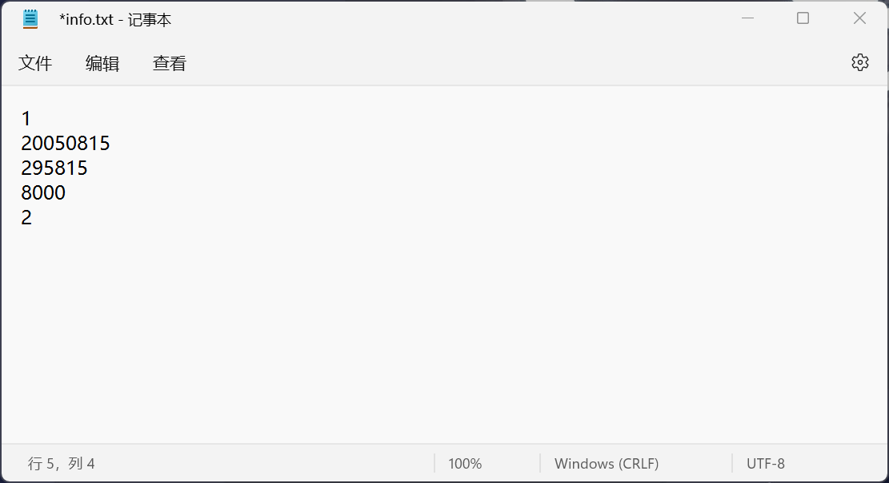
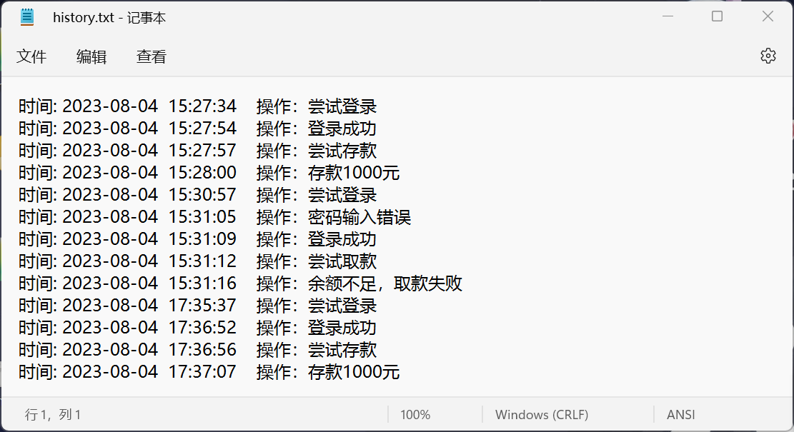
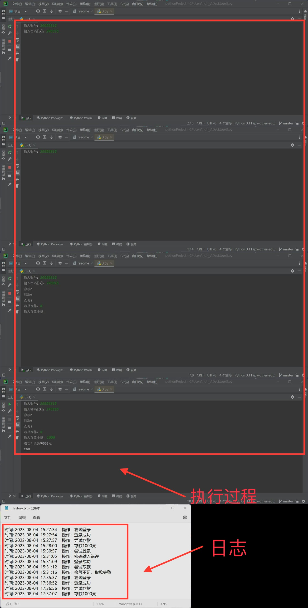

# **尊嘟假嘟**
简介  
用python实现对银行业务的简单模拟，功能包含对账户/密码的验证、多次输入密码错误冻结账户、存款、取款、余额查询、日志记录。
## 安装和调试
### [1.安装Python解释器](https://www.python.org)
该代码编写时的Python解释器版本为3.11，实际更低版本也可使用
### 2.用户信息创建和填入
#### 2.1账户信息创建和填入
step1：创建一个.txt文件(后文用a代替此文件)    
step2：第一行填入0或1，用于效验账户的可用性，0代表不可用，1代表可用，你最好默认设为1  
Step3：第二行填入账户编号  
Step4：第三行填入账户密码  
step5：第四行填入余额  
step6：第五行填入剩余密码输入次数，你可以自行更改  
注意：账户信息必须为数字，不能包含字母、下划线等  
正确创建是这个样子  

#### 2.2日志信息的创建和填入
Step1：创建一个用于保存日志的.txt文件(后文用b代替此文件)    
step2：日志信息将由程序自动填入  
效果图  

### 3.代码的完善
修改代码，填入将文件a和文件b的新地址，填入的具体位置可以在代码注释中查看
### 4.运行程序
使用pycharm、VS Code或py.exe运行程序  
完整执行效果  

